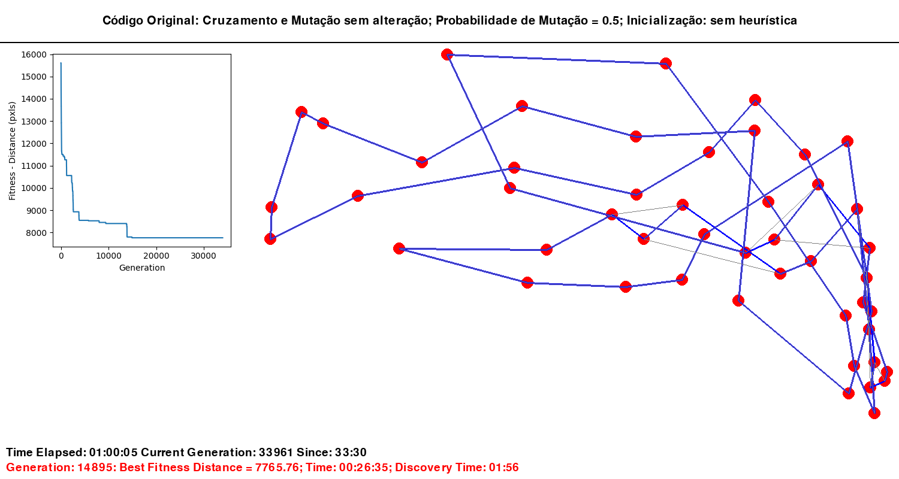
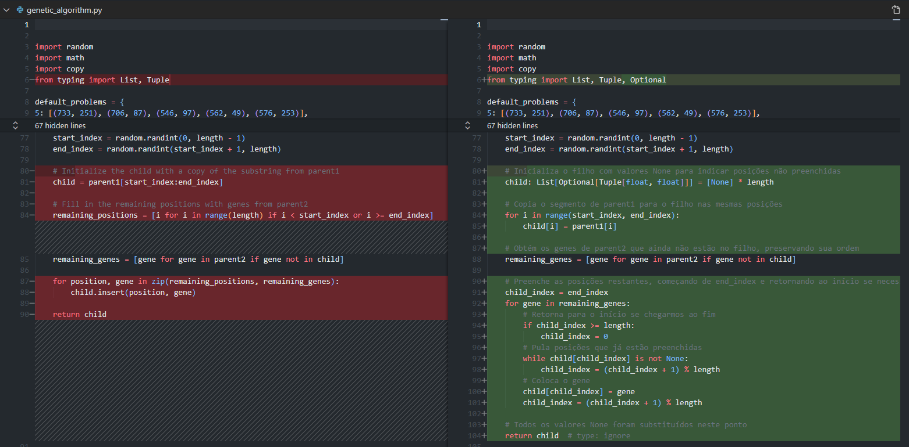
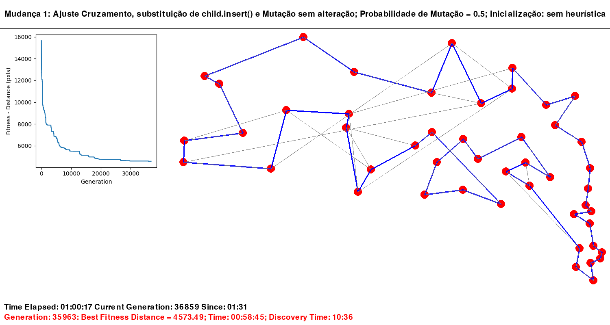
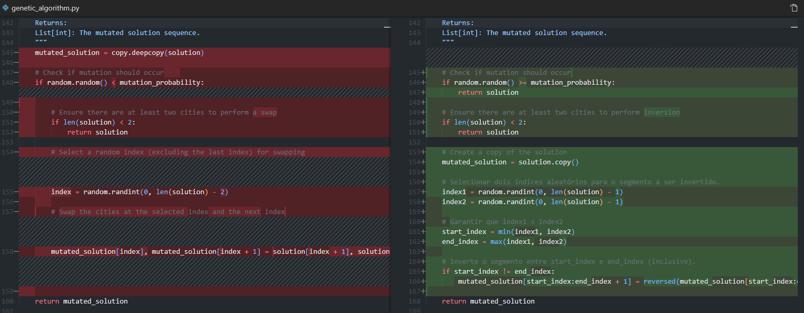
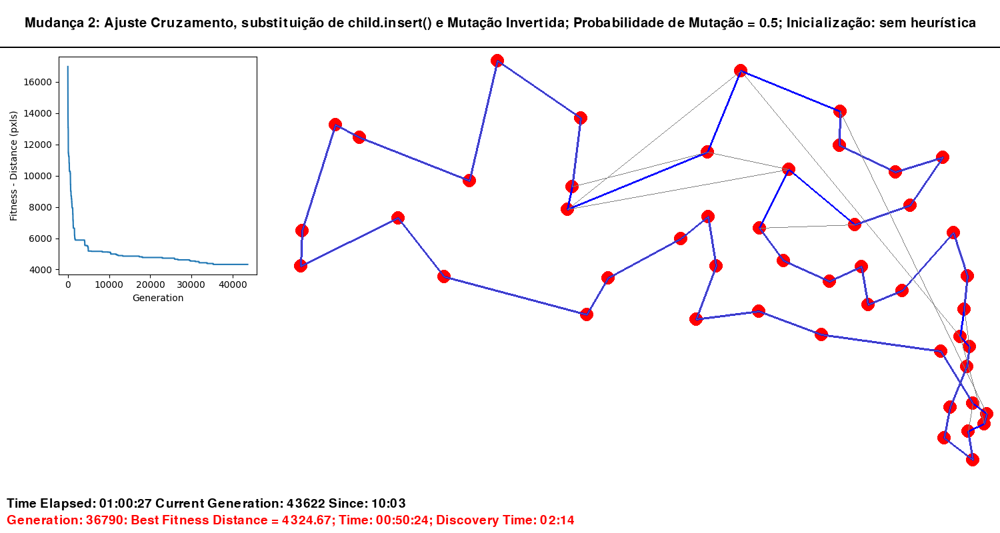
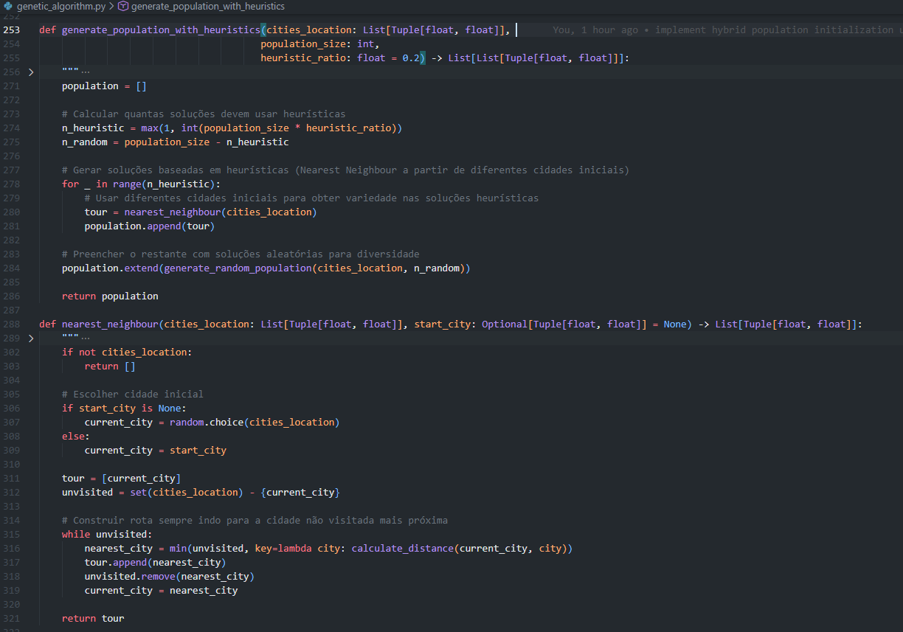
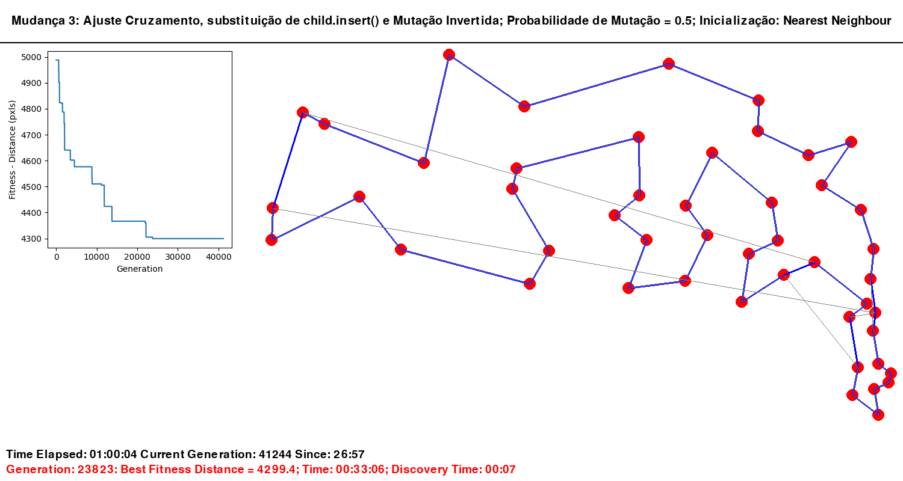

# Análise Experimental: Otimização do TSP com Algoritmos Genéticos

## Introdução

Este documento apresenta uma análise experimental da aplicação de algoritmos genéticos para resolução do Problema do Caixeiro Viajante (TSP - Travelling Salesman Problem), utilizando os operadores genéticos de seleção, cruzamento e mutação. O objetivo é encontrar a menor distância percorrida entre cidades utilizando o benchmark att48.

## Metodologia

Para todos os experimentos, foi estabelecido um tempo limite de execução de **1 hora**. Durante esse período, o algoritmo foi executado continuamente, registrando-se a geração e o tempo necessário para encontrar o melhor resultado. Os experimentos foram realizados de forma cumulativa, ou seja, cada melhoria implementada foi mantida nos experimentos subsequentes.

---

## Experimento 1: Implementação Base

### Descrição

Neste experimento inicial, o algoritmo foi executado com o código original, sem modificações ou melhorias. O objetivo foi estabelecer uma linha de base (baseline) para comparação com as otimizações futuras.

### Resultado

**Generation 14895: Best fitness = 7765.56; Time: 00:26:35**

O algoritmo alcançou a menor distância de **7765.56 pixels** na geração 14895, aos 26 minutos e 35 segundos de execução. Após este ponto, durante os 33 minutos restantes até completar 1 hora, nenhuma solução melhor foi encontrada, indicando uma possível convergência prematura ou estagnação do algoritmo.

*Figura 1: Visualização da melhor solução encontrada no Experimento 1 (baseline). Fitness: 7765.56 pixels.*

### Análise

O resultado demonstra que, embora o algoritmo seja capaz de encontrar soluções, há espaço significativo para otimização tanto na qualidade da solução quanto na eficiência computacional.

---

## Experimento 2: Otimização do Operador de Cruzamento

### Descrição

Neste experimento, foi realizada uma refatoração significativa da função `order_crossover()`. A principal modificação consistiu na substituição do método `insert()`, que causava desordenação dos índices durante a iteração do loop, potencialmente gerando resultados incorretos.

### Implementação

A nova implementação inicializa o filho (child) com valores `None` para representar posições não preenchidas, preenchendo-as posteriormente de forma ordenada. Embora o código resultante seja maior, a eficiência demonstrou ser superior ao uso de `child.insert()`.

*Figura 2: Implementação otimizada da função order_crossover().*

### Resultado

**Generation 35963: Best fitness = 4573.49; Time: 00:58:45**

O algoritmo alcançou a menor distância de **4573.49 pixels** na geração 35963, aos 58 minutos e 45 segundos.

*Figura 3: Visualização da melhor solução encontrada no Experimento 2. Fitness: 4573.49 pixels.*

### Análise

A otimização do operador de cruzamento resultou em uma **melhoria de 41,1%** em relação ao experimento baseline, demonstrando a importância da corretude e eficiência dos operadores genéticos.

---

## Experimento 3: Otimização do Operador de Mutação

### Descrição

Este experimento focou na otimização da função `mutate()`, implementando a inversão de segmentos ao invés de apenas realizar swap de dois elementos. Adicionalmente, foram realizadas as seguintes melhorias:

- Substituição de `deepcopy()` por `copy()`, reduzindo overhead computacional
- Inversão da lógica de verificação da probabilidade de mutação para maior clareza
- Implementação efetiva da inversão de segmentos

### Implementação

*Figura 4: Implementação otimizada da função mutate() com inversão de segmentos.*

### Resultado

**Generation 36790: Best fitness = 4324.67; Time: 00:50:24**

O algoritmo alcançou a menor distância de **4324.67 pixels** na geração 36790, aos 50 minutos e 24 segundos. Destaca-se que, aos 39 minutos de execução, já havia superado o resultado do Experimento 2 com uma distância de 4565.82 pixels na geração 29509.

*Figura 5: Visualização da melhor solução encontrada no Experimento 3. Fitness: 4324.67 pixels.*

### Análise

A otimização do operador de mutação proporcionou uma **melhoria adicional de 5,4%** em relação ao Experimento 2, e uma **melhoria acumulada de 44,3%** em relação ao baseline. Além disso, o algoritmo demonstrou maior capacidade de exploração do espaço de busca, encontrando melhorias contínuas ao longo do tempo de execução.

---

## Experimento 4: Inicialização com Heurística Nearest Neighbour

### Descrição

Neste experimento final, foi implementada uma função de inicialização utilizando a heurística **Nearest Neighbour** (vizinho mais próximo). A implementação inclui um parâmetro `heuristic_ratio` que permite definir uma inicialização híbrida: um percentual da população é gerado usando a heurística, enquanto o restante permanece aleatório.

Para este experimento, foi utilizado `heuristic_ratio = 0.5`, resultando em uma população inicial com 50% de indivíduos gerados heuristicamente e 50% aleatórios (padrão: 20%).

### Implementação

*Figura 6: Implementação da inicialização híbrida utilizando heurística Nearest Neighbour.*

### Resultado

**Generation 23823: Best fitness = 4299.4; Time: 00:33:06**

O algoritmo alcançou a menor distância de **4299.40 pixels** na geração 23823, aos 33 minutos e 6 segundos. Vale ressaltar que aos 30 minutos, o algoritmo já havia encontrado uma solução com distância de 4305.27 pixels na geração 22143.

*Figura 7: Visualização da melhor solução encontrada no Experimento 4. Fitness: 4299.40 pixels.*

### Análise

A implementação da inicialização heurística resultou em uma **redução do tempo de convergência em 34,1%** (de 50:24 para 33:06), mantendo uma **melhoria de qualidade de 44,7%** em relação ao baseline. Este resultado demonstra que uma inicialização inteligente da população pode acelerar significativamente a convergência do algoritmo genético.

---

## Discussão e Conclusões

### Resumo dos Resultados

| Experimento | Melhor Fitness | Geração | Tempo | Melhoria vs Baseline |
|-------------|----------------|---------|-------|----------------------|
| 1 (Baseline) | 7765.56 | 14895 | 00:26:35 | - |
| 2 (Cruzamento) | 4573.49 | 35963 | 00:58:45 | 41.1% |
| 3 (Mutação) | 4324.67 | 36790 | 00:50:24 | 44.3% |
| 4 (Heurística) | 4299.40 | 23823 | 00:33:06 | 44.7% |

### Aprendizados

1. **Corretude dos Operadores**: A refatoração do operador de cruzamento demonstrou que a implementação correta dos operadores genéticos é fundamental para o desempenho do algoritmo.

2. **Diversidade Genética**: A implementação adequada do operador de mutação com inversão de segmentos contribuiu para manter a diversidade genética e evitar convergência prematura.

3. **Inicialização Inteligente**: A utilização de heurísticas na inicialização da população reduz significativamente o tempo de convergência, sem comprometer a qualidade da solução final.

4. **Melhorias Cumulativas**: Cada otimização implementada contribuiu para o resultado final, demonstrando a importância de uma abordagem sistemática e incremental na otimização de algoritmos genéticos.

### Conclusão

Os experimentos realizados demonstraram que a combinação de operadores genéticos bem implementados com inicialização heurística resulta em um algoritmo genético robusto e eficiente para o problema TSP. A melhoria acumulada de 44.7% no fitness e a redução de 34.1% no tempo de convergência comprovam a eficácia das otimizações propostas.

---

## Referências

- **Benchmark**: att48 (48 cidades)
- **Duração dos experimentos**: 1 hora cada
- **Configurações**: População de 100 indivíduos, probabilidade de mutação = 0.5
